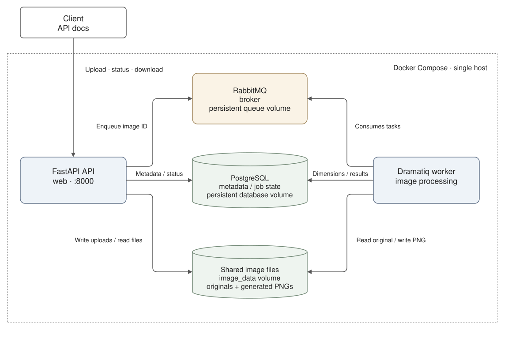

# Image processor

A small containerized application for asynchronous image processing. Upload an image through a REST API; a background worker extracts its dimensions and creates a pixel-shuffled PNG, leaving the original unchanged.

Built with Python, FastAPI, Dramatiq, RabbitMQ, and PostgreSQL. This is a learning project, not a production-ready image service.

## Getting started

```sh
cp .env.example .env
docker compose -f compose.app.yaml up --build -d
```

Once startup completes:

- **API docs:** http://localhost:8000/docs
- **RabbitMQ management:** http://localhost:15672 - username and password: `image_processor`

To stop the app:

```sh
docker compose -f compose.app.yaml down
```

## Debug web console

The optional [SvelteKit debug console](debug_test_webapp/README.md) lives in `debug_test_webapp/` and runs separately from Compose. It shows upload reservations, live processing states, paginated original/generated comparisons, failure details, metadata actions, and a request inspector. Existing backend volumes remain the source of persistent data. **Fully vibe-coded, not a purpose of this repo**

```sh
cd debug_test_webapp
pnpm install
cp .env.example .env
pnpm dev
```

Open http://127.0.0.1:5173 with the backend running and `DEBUG=true` set for the API at startup (for Compose, set it in the backend `.env` before recreating the API). `DEBUG=false` leaves `/debug/*` unregistered and absent from OpenAPI. DEBUG is not authentication. The debug endpoints are unauthenticated and intended for local use only.

## Architecture

The API and background worker run as separate Docker Compose services. The API publishes tasks to RabbitMQ; the independently running worker consumes and executes them. RabbitMQ is the message broker—it does not start or run the worker.



[Editable draw.io source](docs/architecture.drawio)

```sh
drawio --export --format svg --theme light --embed-svg-fonts false \
  --border 16 --output docs/architecture.svg docs/architecture.drawio
```

- **FastAPI API** reserves uploads, accepts image bytes, publishes jobs, and serves metadata and downloads.
- **RabbitMQ** carries processing tasks containing image IDs—not image files.
- **Dramatiq worker** runs separately from the API, consumes queued tasks, reads the original, extracts dimensions, writes a shuffled PNG, and updates job state.
- **PostgreSQL** stores image metadata, processing status, and links between originals and generated images.
- **Shared image volume** stores the actual bytes and is mounted by both the API and worker.

The request flow is:

1. The client reserves an upload; the API creates a metadata record in PostgreSQL.
2. The client uploads bytes; the API saves them to the shared volume and queues the image ID.
3. The worker consumes the task, processes the file, and saves the generated image and metadata.
4. The client polls the API for completion and downloads the result through the API.

## Notes

- This setup is for local use: there is no authentication, the example credentials are public, and infrastructure ports are published to the host. Do not expose it to the internet.
- File storage is a shared Docker volume on one host, not an object-storage service. Workers on separate hosts would need a different storage setup.
- Database updates and queue publication are separate operations, not one atomic transaction. Publisher confirmations do not guarantee automatic recovery from every interrupted upload or enqueue.
- The worker retries database errors; other processing errors are not automatically retried. `/health` reports that the API is responding, not that every dependency is healthy.
